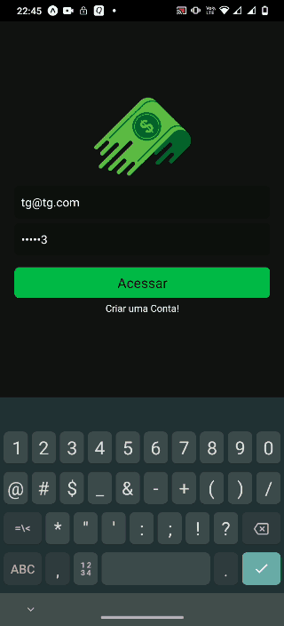
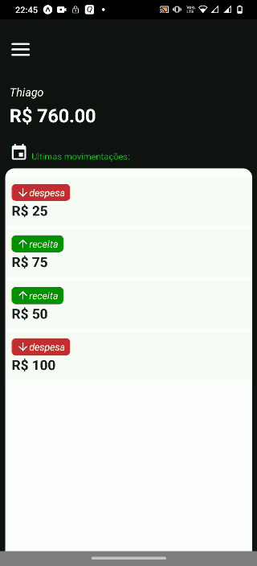

# financas-moedas-app


Aplicativo de finanças pessoais desenvolvido em React Native durante o curso Fabrica de Aplicativos para fins de estudo. Registra despesas e receitas de cada usuário. 
Utilizou-se o Realtime Database (firebase) para armazenar os dados de cada usuário.

<br/>
<p align = "center"></p>
<br/>

<p align="center">
    
</p>
<br/>
<p align="center">
    
</p>


## Tecnologias
- [React Native v0.64.3](https://reactnative.dev/)
- [EXPO v5.1.2](https://github.com/expo/expo)

___

## Instalação

Clone o projeto e acesse a sua pasta: 

```sh
$ git clone https://github.com/thiagoemanoel98/financas-app.git
$ cd financas-app
```

Instale as dependências do projeto e inicie:

```sh
# Dependências
$ expo install

# Start
$ expo start
```

___

Made with :coffee: by Thiago Emanoel :v:
